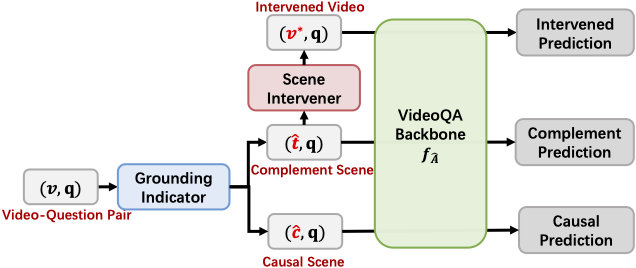

<h2 align="center">
Invariant Grounding for Video Question Answering 🔥
</h2>

<div align="center">

[](https://openaccess.thecvf.com/content/CVPR2022/papers/Li_Invariant_Grounding_for_Video_Question_Answering_CVPR_2022_paper.pdf)
[](https://github.com/yl3800/IGV) 
[](https://youtu.be/wJhR9_dcsaM) 
</div>


## Overview 
This repo contains source code for **Invariant Grounding for Video Question Answering** (CVPR 2022 Oral, Best Paper Finalists). In this work, propose a new learning framework, Invariant Grounding for VideoQA (**IGV**), to ground the question-critical scene, whose causal relations with answers are invariant across different interventions on the complement. With IGV, the VideoQA models are forced to shield the answering process from the negative influence of spurious correlations, which significantly improves the reasoning ability.

<p align="center">
    < </center>
</p>

## Installation
- Main packages: PyTorch = 1.11 
- See `requirements.txt` for other packages.

## Data Preparation
We use MSVD-QA as an example to help get farmiliar with the code. Please download the dataset in `dataset.zip` and the pre-computed features [here](https://drive.google.com/file/d/1wXJWnIWiVekOy4dfzlDMSAEC-IKDuxbT/view?usp=sharing)

After downloading the data, please modify your data path and feature path in `run.py`.

## Run IGV

Simply run `train.sh` to reproduce the results in the paper. We have saved our checkpoint [here](https://drive.google.com/file/d/1oQfLa9ZIjiYTM8Dw8vEFNylgifsv4hYf/view?usp=sharing) (acc 41.42% on MSVD-QA) for your references.


## Reference 
```
@InProceedings{Li_2022_CVPR,
    author    = {Li, Yicong and Wang, Xiang and Xiao, Junbin and Ji, Wei and Chua, Tat-Seng},
    title     = {Invariant Grounding for Video Question Answering},
    booktitle = {Proceedings of the IEEE/CVF Conference on Computer Vision and Pattern Recognition (CVPR)},
    month     = {June},
    year      = {2022},
    pages     = {2928-2937}
}
```

## Acknowledgement
Our reproduction of the methods is based on the respective official repositories and [NExT-QA](https://github.com/doc-doc/NExT-OE), we thank the authors to release their code.
